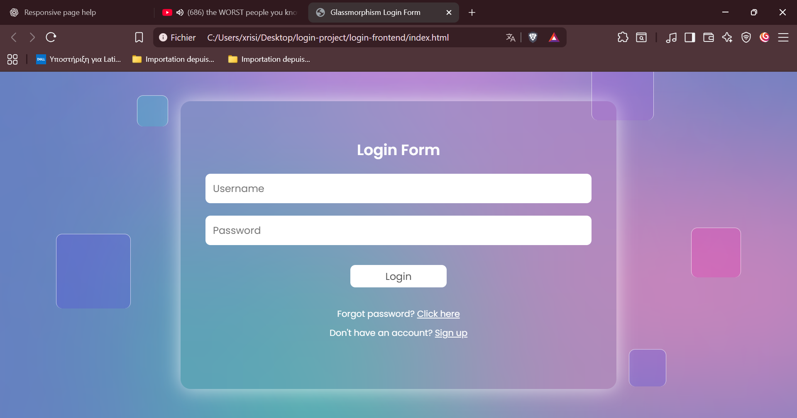
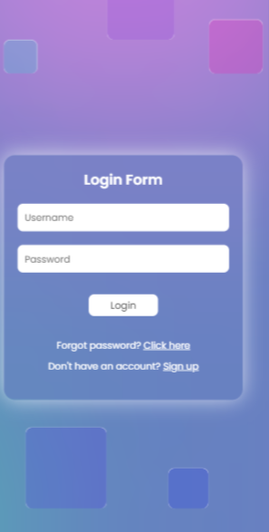

# Login Project

A simple login, signup, and password reset system built with **HTML, CSS, JavaScript (frontend)** and **Node.js + Express (backend)**. Stores user data in a JSON file for easy local testing.

---

## Table of Contents

* [Project Structure](#project-structure)
* [Features](#features)
* [Installation & Setup](#installation--setup)
* [Demo](#demo)
* [Screenshots](#screenshots)
* [Tech Stack](#tech-stack)
* [Notes](#notes)
* [License](#license)

## Project Structure

```
login-project/
├── login-frontend/   # HTML, CSS, JS files for the UI
├── login-backend/    # Node.js + Express server
```

---

## Features

* User signup with validation
* Login with saved credentials
* Forgot/reset password functionality
* Password hashing using **bcrypt** for secure storage
* Prevents setting the same password again
* JSON file storage (no database needed)
* Secure backend handling for authentication requests
* Frontend demo UI that works without backend (static only)

---

## Installation & Setup

### 1. Clone the repository

```bash
git clone https://github.com/CEYEb3r/login-project.git
cd login-project
```

### 2. Backend Setup

```bash
cd login-backend
npm install
node server.js
```

The backend runs on `http://localhost:3000`.

### 3. Frontend Setup

Simply open `login-frontend/index.html` in your browser. You can also serve it via Live Server in VS Code.

---

## Demo

You can preview the UI only without running the backend by opening:

```
login-frontend/index.html
```

Note: Login, signup, and reset password functions will not work unless the backend server is running.

---

## Screenshots

### Desktop View



### Mobile View



---

## Tech Stack

* **Frontend:** HTML, CSS, JavaScript
* **Backend:** Node.js, Express
* **Security:** bcrypt for password hashing
* **Data Storage:** JSON file

---

## Notes

* This project is for local testing and learning.
* Not intended for production use without additional security improvements.

---

## License

MIT License
